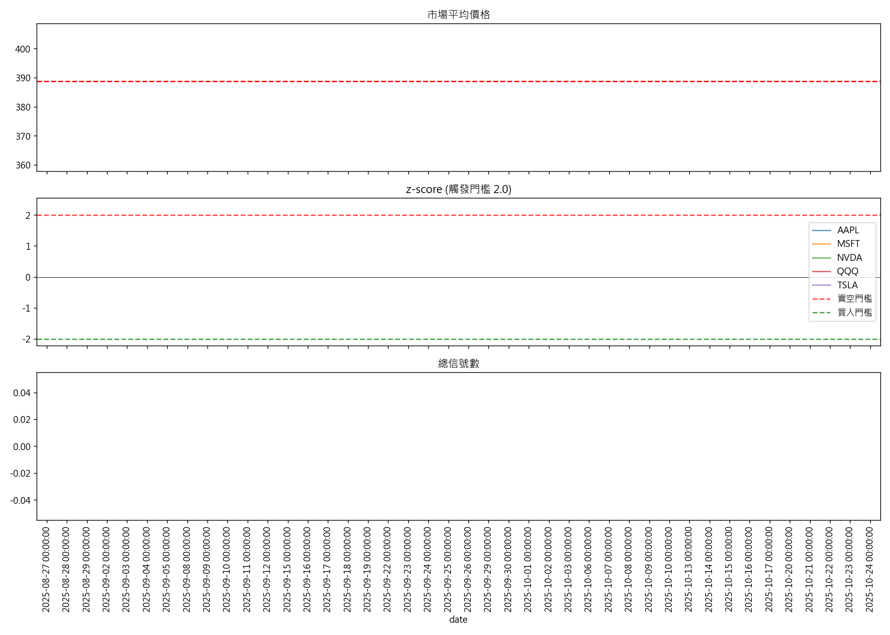

# A1 Agent 全天候分析日誌 - 2025-10-26

**市場標的**：QQQ, NVDA, TSLA, AAPL, MSFT
**觸發信號**：0 檔
**觀察名單**：5 檔

**今日無交易信號**

## 觀察名單
### **QQQ 觀察報告**：  
- **狀態**：Z‑score 1.96、距離均值 +2.0% 已接近傳統的 2σ 賣空門檻；近 5 日報酬 +0.44% 表示仍有短期上漲空間，尚未完全觸發逆轉。  
- **建議**：  
  1. 以日收盤為觀察點，若 Z‑score 超過 2.0（或 2.2）並伴隨成交量放大，視為賣空訊號。  
  2. 觀察技術面：若出現逆轉形態（如雙頂、看跌吞沒）或 5 日移動平均線出現下跌交叉，則加強賣空判斷。  
  3. 若 Z‑score 在 2.0–2.2 之間持續 1–2 天且沒有明顯回檔，考慮在下一個低點賣空；若持續上升且成交量放大，視為高風險持倉。  
- **結論**：QQQ 已進入過熱區，接近賣空門檻；需密切觀察 Z‑score 變化與成交量，確認逆轉後再進場。

### **NVDA 觀察報告**：  
- **狀態**：目前 NVDA 的 z‑score 為 0.45，距離均值正向 0.9%，近 5 日報酬亦為 +0.34%，整體呈現輕度正向動能，尚未達到典型的買入（z < -1）或賣空（z > 1）閾值。  
- **建議**：保持觀察，特別留意接下來 5–10 天內的價格是否持續維持在均值上方，或是否出現突破性走高/走低。若 z‑score 上升至 1 以上，或價格突破近期高點並持續上漲，則可考慮買入；若 z‑score 下降至 -1 以下，或價格跌破均值並持續下跌，則應考慮賣空。  
- **結論**：NVDA 現在處於輕度牛市階段，離任何買入或賣空觸發點還有距離，建議先持續觀察以確定趨勢的持續性。

### **TSLA 觀察報告**：  
- **狀態**：目前 TSLA 的 z‑score 為 **-0.47**，距離均值 **-1.1%**，近 5 日報酬僅 **-0.23%**。數值都落在中性區間，尚未達到常見的買入（z>+1.5）或賣空（z<-1.5）閾值；因此，**目前並未接近觸發買入或賣空**。  
- **建議**：  
  1. **觀察時段**：持續追蹤下一 **3‑5 個交易日**，觀察 z‑score 及均值距離的變化。  
  2. **預期觸發點**：  
     - 若 z‑score 進一步偏離 **-1.0** 且距離均值 **>1.5%**，可考慮短期賣空；  
     - 若 z‑score 轉正並逼近 **0**，距離均值 **<0.5%**，則可考慮買入。  
  3. **市場環境**：科技股整體走勢若呈現弱勢，可能加速負面偏離；若市場反彈，則可能促使 z‑score 回正。  
- **結論**：目前 TSLA 在量化指標上仍處於中性區，建議持續觀察，等待更明顯的偏離或市場情緒轉變後再決定進場。

### **AAPL 觀察報告**：  
- **狀態**：目前 AAPL 以 z‑score 1.47 與均值正偏 3.1%，近 5 天回報 +0.84%，表現為溫和上升，但尚未達到通常視為買入或賣空極端水平（z‑score 超過 ±2）。  
- **建議**：持續觀察 1–2 週內的價格行為，若 z‑score 進一步突破 ±2 或距離均值上升至 ±4%，可考慮作為買入或賣空的觸發點；同時留意成交量放大與市場情緒轉變。  
- **結論**：AAPL 處於穩健上漲階段，尚未觸發買入/賣空極端信號，建議保持觀察並等待更明確的突破。

### **MSFT 觀察報告**：
- **狀態**：目前 z-score 為 1.14，距離均值 +1.1%，顯示股價已略高於長期均值；近 5 日報酬正向 (+0.39%) 亦表現出短期正向動能。雖然已超過一般 1.0 的超買門檻，但尚未達到常用的 1.5 或 2.0 觸發賣空的水準，因而屬於「略超過均值、尚未強勢超買」的狀況。  
- **建議**：建議持觀察，持續追蹤 z-score 與 5 日報酬。若 z-score 再度升至 1.3–1.5 以上，或 5 日報酬出現負值時，可考慮設置賣空或減倉；若短期動能持續正向並且市場科技股環境良好，可維持觀望或採取小額買入作為加碼。  
- **結論**：MSFT 當前呈現略微超買但尚未觸發賣空門檻，仍需持續觀察以判斷是否出現逆轉。

